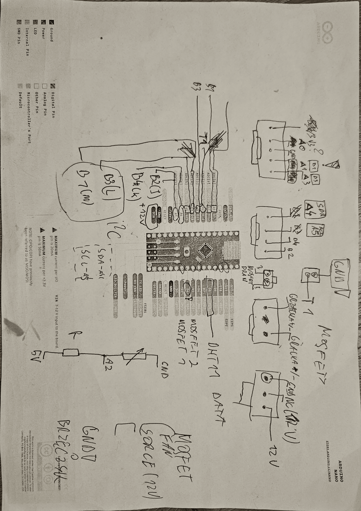

# Drybox Controller

An Arduino Nano-based filament drybox controller with PID temperature control, OLED display, and preset drying profiles for various 3D printer filaments.



## Features

- **PID Temperature Control**: Precise heating with custom PID implementation
- **Multiple Profiles**: Pre-configured settings for PLA, PETG, ABS, TPU, and Nylon
- **Real-time Monitoring**: DHT11 sensor for ambient temperature and humidity
- **OLED Display**: 128x64 I2C display showing status and controls
- **Safety Features**: Overheat protection and sensor fault detection
- **Audio Feedback**: Buzzer for user interaction confirmation

## Hardware Requirements

- Arduino Nano (ATmega328P)
- DHT11 Temperature/Humidity Sensor
- SSD1306 OLED Display (128x64, I2C)
- 100kΩ NTC Thermistor with 6.8kΩ resistor
- 4 Push Buttons (UP, DOWN, OK, BACK)
- 2x N-channel MOSFETs for heater and fan control
- Active buzzer
- 12V Heating element
- 12V Circulation fan

## Pin Configuration

| Pin  | Function       | Notes                              |
|------|----------------|------------------------------------|
| D3   | Heater PWM     | Timer2 PWM, MOSFET gate            |
| D5   | Fan Control    | Digital, MOSFET gate               |
| D8   | DHT11 Data     | Temperature/Humidity sensor        |
| A0   | Buzzer         | Active buzzer                      |
| A1   | Button UP      | INPUT_PULLUP                       |
| A2   | Thermistor     | 6.8k divider to 5V                 |
| A3   | Button OK      | INPUT_PULLUP                       |
| A4   | OLED SDA       | Display data                       |
| A5   | OLED SCL       | Display clock                      |
| A6   | Button DOWN    | External 10k pull-up required      |
| A7   | Button BACK    | External 10k pull-up required      |

## Getting Started

### Prerequisites

- [PlatformIO](https://platformio.org/) installed (VS Code extension or CLI)
- Arduino Nano connected via USB

### Building and Uploading

```bash
# Clone the repository
git clone git@github.com:Granulka/drybox.git
cd drybox

# Build the firmware
pio run

# Upload to Arduino Nano
pio run --target upload

# Monitor serial output (optional)
pio device monitor
```

### Using the Controller

1. **Power On**: System starts in IDLE mode showing current temperatures
2. **Press OK**: Enter menu to select drying profile
3. **Navigate**: Use UP/DOWN buttons to select profile
4. **Start Cycle**: Press OK to begin drying
5. **Monitor**: Display shows temperature, PWM%, and remaining time
6. **Abort**: Press BACK during cycle to stop early
7. **Complete**: System beeps when cycle finishes

## Drying Profiles

| Filament | Temperature | Duration |
|----------|-------------|----------|
| PLA      | 45°C        | 4 hours  |
| PETG     | 65°C        | 6 hours  |
| ABS      | 65°C        | 6 hours  |
| TPU      | 50°C        | 6 hours  |
| Nylon    | 75°C        | 12 hours |

## Safety Features

- Maximum temperature cutoff at 90°C
- Thermistor fault detection
- Automatic heater shutdown on error
- Fault state with warning beep
- Display initialization check

## Documentation

For detailed technical documentation, see [claude.md](claude.md)

## Project Structure

```
Drybox/
├── platformio.ini          # PlatformIO configuration
├── src/
│   └── main.cpp           # Main firmware
├── README.md              # This file
└── claude.md              # Detailed technical documentation
```

## Contributing

Feel free to submit issues and pull requests for improvements!

## License

Open source - modify and distribute freely

## Acknowledgments

- Initial code developed with ChatGPT assistance
- Hardware design and implementation by project creator
